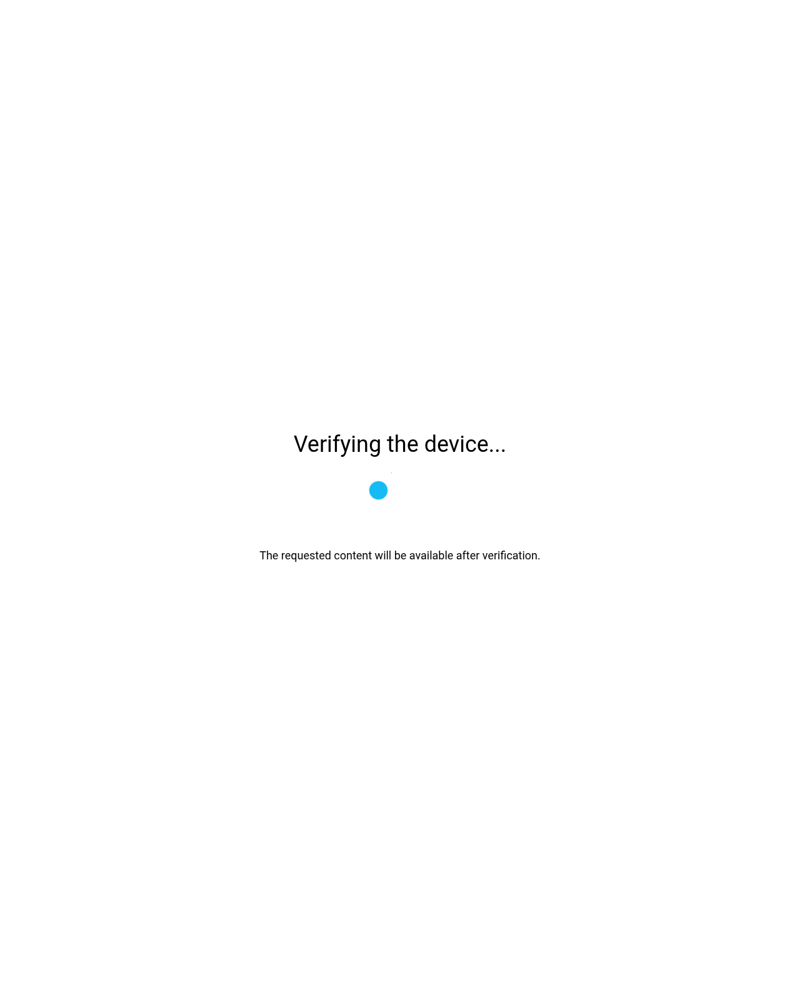

# dsh-google-chrome-search

[](https://github.com/davidcastilloalvarado/dsh-google-chrome-search/actions/workflows/ci.yml)
[](./LICENSE)
[](https://nodejs.org)

A **DeepSeek Harness (DSH) plugin** that lets an **AI agent** run a real **Google web search**
by driving the **local Chrome** browser over CDP (Chrome DevTools Protocol), and **render any
page to extract its content**. **No search API key needed** — it works with the Chrome already
installed on the machine.

Google frequently serves a human-verification page (CAPTCHA / "unusual traffic") for automated
and datacenter traffic. When that happens, this plugin **opens a visible Chrome window** pointed
at the verification page, **waits for the human to solve it**, and then extracts the results
from the now-trusted session. That is the "ask the human" step — by design, the agent never
tries to solve a CAPTCHA itself.



## What you get

| Piece | Path | Purpose |
|---|---|---|
| Core engine | `src/search.mjs` | Chrome/CDP Google search + CAPTCHA verification + result extraction + Google **AI Overview** capture (AI-generated answer + cited references) |
| Page engine | `src/fetch.mjs` | Render any URL + extract readable content (Mozilla Readability) + `search_and_fetch` |
| Login engine | `src/login.mjs` | Sign in with a Google account (visible window) + session check, kept in the persistent profile |
| MCP server | `src/server.mjs` | Exposes `search`, `fetch`, `search_and_fetch`, `login`, `account` over stdio → native `mcp__chinchilla-websearch__*` in DSH |
| CLI | `bin/google-search.mjs` | `dsh-google-search "<query>"`, `fetch "<url>"`, `login`, `account`, `install-browser`, `mcp` — direct use / npx |
| Skill | `skill/SKILL.md` | Teaches the agent how to use it + the human-verification workflow |

## Quick start (no install — npx)

```sh
npx dsh-google-chrome-search "nodejs streams" --max 8
```

That's it — no clone, no API key. The first run downloads the package (a few
seconds, then cached). The browser is auto-detected from your system, or
installed once with `npx dsh-google-chrome-search install-browser` (see below).

## Requirements

- **Node.js ≥ 18** (tested on Node 22)
- **A Chrome/Chromium-family browser** (Chrome, Chromium, Brave, Edge — any
  CDP-compatible browser). Auto-detected from common paths and `PATH`; override
  with `CHROME_PATH` or `--chrome`. Or install the bundled **Chrome for
  Testing** once: `npx dsh-google-chrome-search install-browser`.
- For the visible-verification step, a desktop session with a display (so the Chrome
  window can be shown to the human). Headless/SSH can still detect the CAPTCHA and report
  it (with a screenshot).

## Install

```sh
git clone https://github.com/davidcastilloalvarado/dsh-google-chrome-search.git
cd dsh-google-chrome-search
npm install
```

Dependencies: `puppeteer-core` (drives your browser over CDP), `@puppeteer/browsers`
(used only by `install-browser` to fetch Chrome for Testing), `@modelcontextprotocol/sdk`
(for the MCP server), `@mozilla/readability` (content extraction), and `zod` (schema
validation).

Optionally link the CLI globally so it is on `PATH`:

```sh
npm link        # gives you: dsh-google-search "<query>"
```

## Install a bundled browser (optional — self-contained setup)

If the machine has **no browser at all**, download a dedicated **Chrome for
Testing** build (latest stable, ~170 MB, one time) into the plugin's profile dir:

```sh
npx dsh-google-chrome-search install-browser
# or with the repo checked out:
node bin/google-search.mjs install-browser
```

It lands in `~/.dsh-chrome-google/browser/` (or under your `GSEARCH_PROFILE`) with a
small marker file (`browser-info.json`). From then on the plugin uses it
**automatically** when no other browser is configured — the resolution chain is:

```
--chrome flag → CHROME_PATH env → bundled Chrome for Testing → system paths (/usr/bin/…) → PATH
```

Notes:

- `--force` re-downloads; it is a no-op while an install is present.
- On a bare **headless Linux server** the system shared libraries may still be missing
  (`libnss3`, `libgbm`, `libasound2`, …) — a normal desktop has them.
- Removing it: delete the `browser/` folder and `browser-info.json` from the profile dir.
- The visible-verification window needs a display either way (desktop, or Xvfb/VNC).

## Use the CLI

```sh
# Search:
node bin/google-search.mjs "nodejs streams" --max 8
# or, after npm install / npm link:
npm run search -- "nodejs streams" --json

# Search, then render + extract the top 3 result pages:
node bin/google-search.mjs "nodejs streams" --max 8 --fetch-top 3 --fetch-max-chars 8000

# Fetch one URL directly (render + extract readable content):
node bin/google-search.mjs fetch "https://nodejs.org/api/stream.html" --max-chars 8000

# Sign in with a Google account (visible window) + check the session:
node bin/google-search.mjs login
node bin/google-search.mjs account --json
```

Exit codes: `0` = success (results / fetched content), `2` = verification required
(CAPTCHA), `3` = no results / fetch blocked or failed, `1` = error, `64` = usage.

## Fetch a page (render + extract)

The plugin can also **render any URL and extract its readable main content**:

- Runs the page in the **same dedicated Chrome profile** (so sites that see a
  consistent, trusted fingerprint behave better).
- Waits for the page to fully load (including late SPA content).
- Extracts the article with **Mozilla Readability**, run inside the live page.
  If the page has no distinct article, it falls back to the full page text.
- Capped output (default **8,000 chars** per page) so it stays agent-context friendly.
- Detects **anti-bot walls** and reports `blocked` instead of returning garbage.
  When a site serves a **human-verification challenge** (e.g. DataDome's "slide to
  continue" wall), it opens a **visible Chrome window** with the page, waits up to
  `verifyTimeoutMs` for the human to pass it, then extracts the real content — the
  same hand-to-human philosophy as the Google CAPTCHA flow. The trusted session
  cookie persists in the profile, so later pages of that site usually pass headless.
  Use `--no-verify` / `autoVerify: false` to just report `blocked` instead.

```sh
dsh-google-search fetch "https://example.com/article" --max-chars 10000
dsh-google-search fetch "https://example.com/article" --html --screenshot
```

Two ways to combine search and reading:

| What | How |
|---|---|
| Search, then read the top N pages in one call | `search_and_fetch` (MCP) / `--fetch-top N` (CLI) |
| Search, then read a specific result | `search`, then `fetch` with the chosen URL |

Pages are rendered **sequentially** (one browser, one page at a time) — expect
~1–3 s per page.

## AI Overview (Google's AI-generated answer)

Every `search` also captures Google's **AI Overview** — the AI-generated answer
that Google shows at the top of the results — **together with the references it
cites**. This is available on the `search` and `search_and_fetch` tools (MCP) and
on `dsh-google-search "<query>"` (CLI).

What you get, in addition to the organic results:

- **The AI answer text** — Google's generated response, cleaned of the UI chrome
  (header, "N sites" label, source-card block) so it reads as the answer alone.
- **The cited references** — the list of sites Google used to build the answer,
  each with a title and a full URL, deduplicated.

```
── AI Overview (Google's AI-generated answer) ──────────────────
Quantum entanglement is a physical phenomenon where two or more particles
become deeply interconnected …

References cited by Google:
 1. scienceexchange.caltech.edu
    https://scienceexchange.caltech.edu/topics/quantum-science-explained/entanglement
 2. science.nasa.gov
    https://science.nasa.gov/what-is-the-spooky-science-of-quantum-entanglement/
 …
```

Notes:

- **It is intermittent.** Google only shows an AI Overview for some queries, and
  it is A/B tested per request. When there is none, the field is `null` and
  nothing is printed — the search still returns its organic results normally.
- **Best-effort, never fails the search.** The AI Overview markup is unstable
  (Google changes classes and layout frequently). Extraction is defensive: if it
  cannot be parsed, the search outcome is unchanged.
- **Structured access.** In `--json` / MCP the outcome carries an `aiOverview`
  object: `{ present: true, text, references: [{ title, url }] }` or `null`.
- Disabling: pass `aiOverview: false` (MCP) or `--no-ai-overview` (CLI) to skip
  the capture entirely.

## Sign in with a Google account (optional — more trusted, longer-lasting session)

The plugin works anonymously out of the box. But Google treats **signed-in accounts** very
differently from anonymous automated traffic: a real, logged-in account is trusted far
more, so **CAPTCHAs become much rarer** and the session **lasts a long time** (until Google
expires it or you reset the profile).

```sh
# Open a visible Chrome window pointed at Google's account page. The human signs in with
# their own Google account; the session cookies are then stored in the persistent profile.
node bin/google-search.mjs login                 # or: npx dsh-google-chrome-search login
node bin/google-search.mjs login --wait 600000   # wait up to 10 min for the human
node bin/google-search.mjs account               # check (headless) whether the profile is signed in
```

As MCP tools: `mcp__chinchilla-websearch__login` and `mcp__chinchilla-websearch__account`.

**Security model:**

- The **agent never sees or handles your credentials** — you type them directly into a real
  Chrome window on your own machine.
- Only **session cookies** end up on disk, and only in the plugin's **own isolated profile**
  (`~/.dsh-chrome-google`), never in your personal browser.
- Treat the profile like a cached password: anyone with access to that folder on that machine
  can use the session while it is valid. Deleting the profile (or signing out from Google)
  revokes it.

Exit codes for `login`: `0` = signed in (or already signed in), `3` = timed out / window
closed before sign-in, `1` = error.

## Use it as a native DSH tool (MCP)

Register the MCP server with DSH's `@deepseek-ai/dsh-mcp-client` in your profile config.
**Zero-clone variant (recommended)** — `npx` fetches the package on demand, so this snippet
works on any machine with Node:

```yaml
- insert:
    - id: mcp-chinchilla-websearch
      name: '@deepseek-ai/dsh-mcp-client'
      config:
        serverName: chinchilla-websearch
        transport: stdio
        command: npx
        args: [ "-y", "dsh-google-chrome-search", "mcp" ]
        toolCallTimeoutMs: 300000
```

**No `env` block needed** — the browser is auto-detected (standard Chrome/Chromium
locations on Linux *and* macOS, plus `PATH`), and the profile defaults to
`~/.dsh-chrome-google` (created on first run). Only if auto-detection misses your
browser, add an `env:` block with the full path — e.g.
`CHROME_PATH: /path/to/your/browser` (and optionally `GSEARCH_PROFILE: /path/to/dir`
to move the trusted session).

(Or, with the repo checked out, point at the files directly:
`command: /path/to/node`, `args: [ /path/to/dsh-google-chrome-search/src/server.mjs ]`.)

After a DSH restart, the agent gets three native tools:

| Tool | What it does |
|---|---|
| `mcp__chinchilla-websearch__search` | Google web search → links + snippets |
| `mcp__chinchilla-websearch__fetch` | Render one URL → extracted readable content (title, byline, text, optional HTML/screenshot) |
| `mcp__chinchilla-websearch__search_and_fetch` | Search → render the top N pages → per-page extracted content in one call |
| `mcp__chinchilla-websearch__login` | Open a visible window so the human signs in with a Google account → session kept in the profile |
| `mcp__chinchilla-websearch__account` | Check (headless) whether the profile holds a signed-in Google account |

Notes:

- Calls are **serialized** (Chrome allows one process per profile), so concurrent
  tool calls queue rather than run in parallel.
- `search_and_fetch` is slower than plain search: keep `toolCallTimeoutMs`
  at `300000` (5 min) as shown above.
- The human-verification flow applies to **both** the Google search (CAPTCHA) and
  to result pages that wall off the browser (anti-bot slider): a visible Chrome
  window opens for the human, and the session persists in the profile afterwards.

## Use it as a DSH skill

`skill/SKILL.md` teaches the agent how to run the search and how to handle the CAPTCHA
hand-off to the human. To install it, copy it into your DSH skills directory, e.g.:

```sh
mkdir -p ~/.dsh/skills/google-chrome-search
cp skill/SKILL.md ~/.dsh/skills/google-chrome-search/
```

**Before sharing/using it on another machine, edit the `<INSTALL_DIR>` placeholder inside
`SKILL.md` to point at where you cloned this repo** (or drop the `npm link` CLI on `PATH`
and it just works).

## Configuration (env / options)

| Option / Env | Default | Meaning |
|---|---|---|
| `chromePath` / `CHROME_PATH` | auto-detect (bundled Chrome for Testing, then system paths, then `PATH`) | Chrome/Chromium-family executable |
| `profileDir` / `GSEARCH_PROFILE` | `~/.dsh-chrome-google` | persistent, dedicated Chrome profile (keeps "verified" cookies) |
| `maxResults` | 8 | organic results to return (max 20) |
| `verifyTimeoutMs` | 150000 | how long to wait for the human to solve a CAPTCHA |
| `autoVerify` | `true` | if `false`, never open a visible window — just report |
| `gl` / `hl` | `us` / `en` | region / language |
| `maxChars` | 8000 | max extracted characters per fetched page (fetch / search_and_fetch) |
| `fetchTop` | 3 | how many result pages to render in `search_and_fetch` (max 5) |
| `includeHtml` / `screenshot` | `false` | fetch options: also return extracted HTML / a page screenshot |
| `timeoutMs` | 20000 | navigation timeout per fetched page |
| `waitMs` | 300000 | how long `login` waits for the human to complete the Google sign-in |

## The human-verification flow, step by step

1. Chrome runs the search headless (a dedicated, isolated profile — never your real browser).
2. If results are present → return them (`status: ok`).
3. If Google serves a CAPTCHA:
   - Screenshot it.
   - Open a **visible** Chrome window (same profile) on the verification page.
   - Wait up to `verifyTimeoutMs` for the human to solve it, polling the page.
   - If solved → extract + return results (flagged `verifiedViaHuman: true`).
     If timed out → return `status: verification_required` with the latest screenshot.
4. The verified session persists in the profile, so the next search usually succeeds headless.

## Releasing (npm + GitHub release)

Releases are manual and tokenless — the same methodology as
`chinchilla-llm-router`. From the GitHub **Actions** tab, run the `release`
workflow with an input like `v1.0.1`:

1. **Before dispatching**: bump `version` in `package.json` to the release
   version (CI never rewrites versions) and commit.
2. The workflow validates the version format, checks it isn't already on npm,
   refuses if the tag exists, runs the test suite, creates the GitHub release
   (with the `npm pack` tarball attached), and publishes to npm.
3. **npm auth is Trusted Publishing (OIDC)**: no token is stored. Set it up
   once on npmjs.com:
   - Create the `production` environment in this repo (Settings → Environments).
   - On npmjs.com, add a **trusted publisher** for the package pointing at this
     GitHub repo, scoped to the `production` environment.
   - The `publish-npm` job runs in that environment; Node 24's npm 11 exchanges
     the GitHub OIDC token for a short-lived registry token automatically
     (`npm publish --provenance`).

## Testing

```sh
npm test
```

Spawns the MCP server, checks the `search`, `fetch`, and `search_and_fetch` tools are
listed, and — if a Chrome binary is available on the machine — performs a live search with
`autoVerify: false`. In environments without a browser (e.g. CI) the live call is skipped
gracefully.

## FAQ

**How is the browser chosen?**
First hit wins:

1. `--chrome` flag
2. `CHROME_PATH` env
3. bundled Chrome for Testing (if you ran `install-browser`)
4. well-known system paths (table below)
5. bare `google-chrome` / `chromium` on `PATH`

Several browsers installed? That order decides — pin one with `CHROME_PATH` or `--chrome`.

| OS | Paths checked |
|---|---|
| Linux | `/usr/bin/google-chrome` · `/usr/bin/google-chrome-stable` · `/usr/bin/chromium` · `/usr/bin/chromium-browser` · `/opt/google/chrome/chrome` |
| macOS | `/Applications/Google Chrome.app/Contents/MacOS/Google Chrome` |

**No browser installed?**
Install the bundled Chrome for Testing once (~170 MB); it is used automatically from then on:

```sh
npx dsh-google-chrome-search install-browser
```

Or install a system browser (`sudo apt install google-chrome-stable` / `brew install --cask google-chrome`). On a bare headless Linux server, shared libraries may still be missing (`libnss3`, `libgbm`, `libasound2`, …).

**Where are the cookies, screenshots, and bundled browser?**
Everything lives in the profile dir — `~/.dsh-chrome-google/` by default (override: `GSEARCH_PROFILE` or `--profile`):

| What | Where |
|---|---|
| Google session cookies (trusted session) | `~/.dsh-chrome-google/Default/Cookies` |
| CAPTCHA screenshots | `~/.dsh-chrome-google/screenshots/` |
| Bundled Chrome for Testing | `~/.dsh-chrome-google/browser/` + `browser-info.json` marker |

Deleting the folder resets the trusted session — the next search likely hits a CAPTCHA again. Your personal Chrome profile is never touched.

**`CHROME_PATH` is set but doesn't work?**
It is used as-is, **no existence check** — a typo or moved binary fails at launch. Test it yourself:

```sh
/path/to/chrome --version
```

Note it overrides everything below it in the chain, including the bundled browser.

**Headless server / SSH?**

- Search and fetch: fully headless, works fine.
- CAPTCHA: detected and reported with a screenshot.
- The "open a window for the human" step needs a display (desktop, or Xvfb/VNC); without one you get `verification_required` + the screenshot.

## Troubleshooting

| Symptom | Fix |
|---|---|
| `Could not find Chrome` / launch error | Run `dsh-google-search install-browser`, or install Chrome/Chromium, or set `CHROME_PATH` / `--chrome` |
| Runs as root in a container, sandbox error | The default is `--no-sandbox` (for isolation); if you want the sandbox on, pass `noSandbox: false` |
| CAPTCHA on every search | Keep the dedicated profile (`~/.dsh-chrome-google`) — deleting it resets the "verified" cookies. Datacenter IPs get CAPTCHAs more often. |
| No visible window appears (SSH / headless) | A window needs a display: use a desktop machine or Xvfb/VNC — or set `autoVerify: false` / `--no-verify` to just report the CAPTCHA with a screenshot (see FAQ) |
| `ECONNREFUSED` / stale lock in the profile | Close all Chrome instances using that profile, then retry (the profile is separate from your personal one). Don't run two CLI calls at once — one process per profile. |
| `fetch` opens a window with a slider / "confirm you are human" | That's the human-verification step working as intended: pass the challenge in the window, then it retries and keeps the session. `--no-verify` skips the window and just reports `blocked`. |
| `fetch` returns `blocked` (no window) | The site walls off headless browsers and `autoVerify` is off (or no display). Try a different source for the same topic, or run with verification enabled. |
| `fetch` returns empty text | The page is JS-heavy and hadn't finished rendering; retry (it settles up to ~7 s), or bump `--timeout`. |

## Revert / clean up

- Config: remove the `mcp-chinchilla-websearch` entry from your DSH profile config.
- Skill: `rm -rf ~/.dsh/skills/google-chrome-search`
- Profile/screenshots (and any bundled browser): `rm -rf ~/.dsh-chrome-google`

## License

[MIT](./LICENSE)
